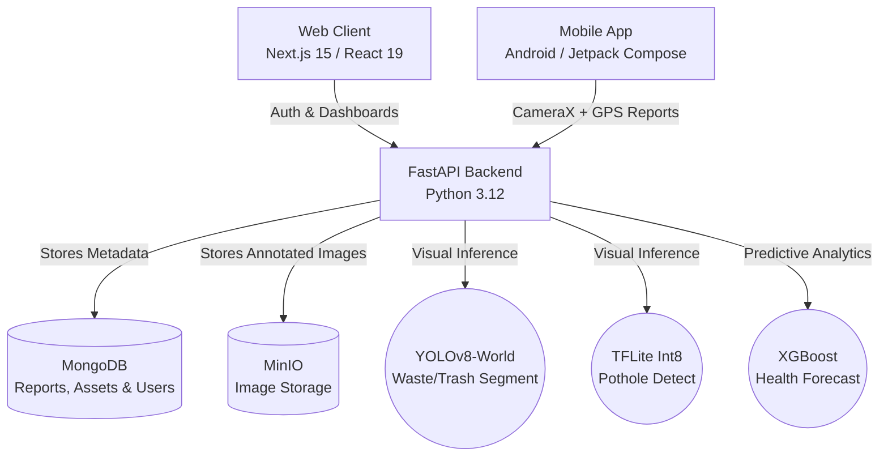
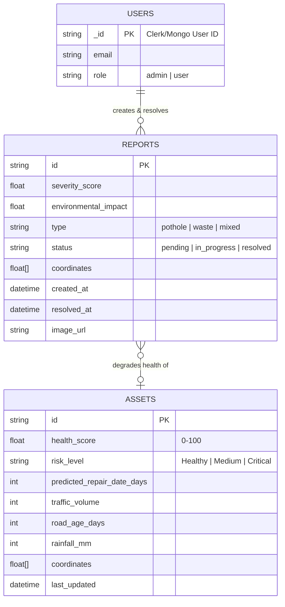

# NetrAI

A comprehensive AI-powered platform for urban infrastructure and civic issue inspection. NetrAI combines computer vision, predictive machine learning, and an intuitive reporting workflow, allowing citizens and city operators to upload geotagged photos, detect issues instantly, track resolutions, and forecast future infrastructure decay.

## 🏗 System Architecture



## 🗄️ Entity-Relationship (ER) Diagram



## ✨ Key Features

### Intelligence & Inference
- **Dual-Model Vision Inference**: Concurrently detects open-vocabulary urban waste (via YOLO-World text prompts) and road damage (via TFLite) in real-time.
- **Predictive Forecasting (XGBoost)**: Tracks persistent road/infrastructure grids and uses historical severities, traffic volume, and rainfall to predict future health decay 30 days out.
- **Smart Auto-Clean**: Uploading a clear photo of an area automatically resolves all pending reports within a 500-meter radius, maintaining an up-to-date city map without manual intervention.

### Web Client & Dashboard
- **Ultra-Premium UI**: Fully responsive dark-glassmorphism dashboard with KPI metric tracking, interactive sidebar navigation, and live data charts.
- **Priority Ranking Engine**: Automatically sorts unresolved infrastructure reports based on an advanced weighted combination of ML severity, traffic volume, and demographic factors, telling municipal officers exactly *what to fix first*.
- **Live Geospatial Tracking**: Interactive mapping powered by Leaflet/OpenStreetMap. Reports snap to a precise ~11m grid to group identical issues together.
- **Authentication**: Fully integrated with Clerk for secure role-based access control.

### Android Mobile App
- **Native Android Experience**: Built natively with Kotlin and Jetpack Compose for high performance.
- **Field Reporting**: Integrated CameraX for quick photo captures directly from the app.
- **Live Location Tagging**: Utilizes Google Play Location Services to automatically append accurate coordinates to each submission.

## 🛠 Technology Stack

| Layer | Technologies |
| --- | --- |
| **Web Frontend** | Next.js 15 (App Router), React 19, Tailwind CSS v4, Recharts, Clerk Auth |
| **Android App** | Kotlin, Jetpack Compose, CameraX, Coil, Play Location Services |
| **Backend API** | Python 3.12, FastAPI, Uvicorn, UV |
| **Machine Learning** | Ultralytics YOLO (Waste), ai-edge-litert (Potholes), XGBoost (Forecasting) |
| **Database** | MongoDB (User sessions, geospatial reports, soft-delete records) |
| **Object Storage** | MinIO (Self-hosted S3-compatible image hosting) |

## 🚀 Quick Start

### 1. Start Databases (Docker Required)
```bash
cd backend
make up
```

### 2. Start Backend API
```bash
cd backend
make install    # This will also pre-download heavy ML weights!
make dev
```
*The FastAPI ML backend runs on `http://127.0.0.1:8000`.*

### 3. Start Web Client
```bash
cd frontend
pnpm install
cp .env.example .env.local  # Make sure to add your Clerk API keys!
pnpm dev
```
*The web client runs on `http://localhost:3000`.*

### 4. Run Android App
Open the `android_app` folder in **Android Studio**. Sync the Gradle files, and build the app directly onto an emulator or physical device.

## 📂 Directory Structure

```text
NetrAI/
 ├── frontend/           # Next.js web application
 │    ├── app/           # App router pages (dashboard, reports, auth)
 │    └── components/    # Reusable UI elements, navigation, and map layers
 ├── backend/            # FastAPI ML service
 │    ├── src/           # Endpoints, ML inference, and config logic
 │    └── scripts/       # Model trainers, mock data generators, and downloaders
 └── android_app/        # Native Android mobile client
      ├── app/src/       # Kotlin Compose UI and camera logic
      └── build.gradle   # Gradle dependencies
```
