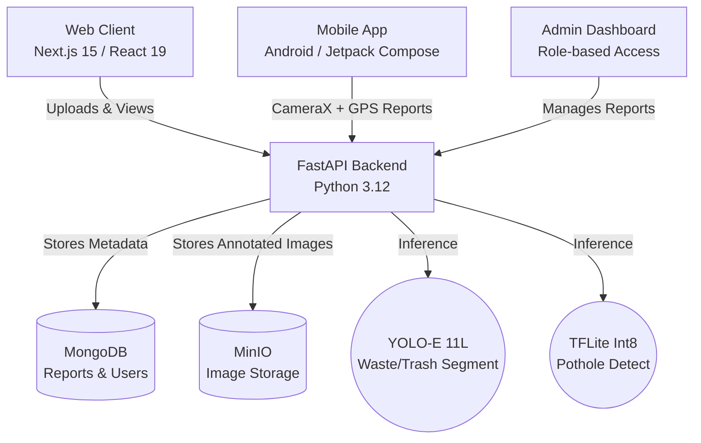

# CivikEye

A comprehensive AI-powered platform for urban infrastructure and civic issue inspection. It combines computer vision with an intuitive reporting workflow, allowing citizens and city operators to upload geotagged photos, detect issues instantly, and track resolution.

## System Architecture



## Key Features

### Intelligence & Inference
- **Dual-Model Inference**: Concurrently detects open-vocabulary urban waste (via YOLO-E) and road damage (via TFLite) in real-time.
- **Smart Auto-Clean**: Uploading a clear photo of an area automatically resolves all pending reports within a 500-meter radius, maintaining an up-to-date city map without manual intervention.
- **Severity Scoring Formulas**: Dynamically calculates "Environmental Impact" and "Road Severity" based on bounding box size, type of waste (e.g., plastic vs. organic), and detection confidence.

### Web Client & Dashboard
- **Live Geospatial Tracking**: Interactive mapping powered by Leaflet/OpenStreetMap. Reports snap to a precise ~11m grid to group identical issues together.
- **Export & Share**: Generate single-click PDF reports detailing the annotated image and coordinates. Create public, login-free URLs for easy sharing.
- **Admin Oversight**: Dedicated workflow allowing administrators to transition reports through `pending`, `acknowledged`, `in_progress`, and `resolved` statuses.

### Android Mobile App
- **Native Android Experience**: Built natively with Kotlin and Jetpack Compose for high performance.
- **Field Reporting**: Integrated CameraX for quick photo captures directly from the app.
- **Live Location Tagging**: Utilizes Google Play Location Services to automatically append accurate coordinates to each submission.
- **Offline Reliability**: Leverages Kotlin Coroutines and WorkManager for stable background uploads.

## Technology Stack

| Component | Stack |
| --- | --- |
| **Web Frontend** | Next.js 15 (App Router), React 19, Tailwind CSS v4, shadcn/ui, Auth.js |
| **Android App** | Kotlin, Jetpack Compose, CameraX, Coil, Play Location Services |
| **Backend API** | Python 3.12, FastAPI, Uvicorn |
| **Machine Learning** | Ultralytics YOLO (Waste), ai-edge-litert (Potholes) |
| **Database** | MongoDB (User sessions, geospatial reports, soft-delete records) |
| **Object Storage** | MinIO (Self-hosted S3-compatible image hosting) |

## Quick Start

### 1. Start Databases (Docker Required)
```bash
cd backend
make up
```

### 2. Start Backend API
```bash
cd backend
make install
make dev
```
*The ML backend runs on `http://127.0.0.1:8000`.*

### 3. Start Web Client
```bash
cd frontend
pnpm install
cp .env.example .env.local  # Update credentials if needed
pnpm dev
```
*The web client runs on `http://localhost:3000`.*

### 4. Run Android App
Open the `android_app` folder in **Android Studio**. Sync the Gradle files, and build the app directly onto an emulator or physical device.

## Directory Structure

```text
CivikEye/
 ├── frontend/           # Next.js web application
 │    ├── app/           # App router pages (dashboard, reports, admin)
 │    └── components/    # Reusable UI elements and map layers
 ├── backend/            # FastAPI ML service
 │    ├── src/           # Endpoints, ML inference, and storage logic
 │    └── weights/       # Auto-downloaded model weights
 └── android_app/        # Native Android mobile client
      ├── app/src/       # Kotlin Compose UI and camera logic
      └── build.gradle   # Gradle dependencies
```
